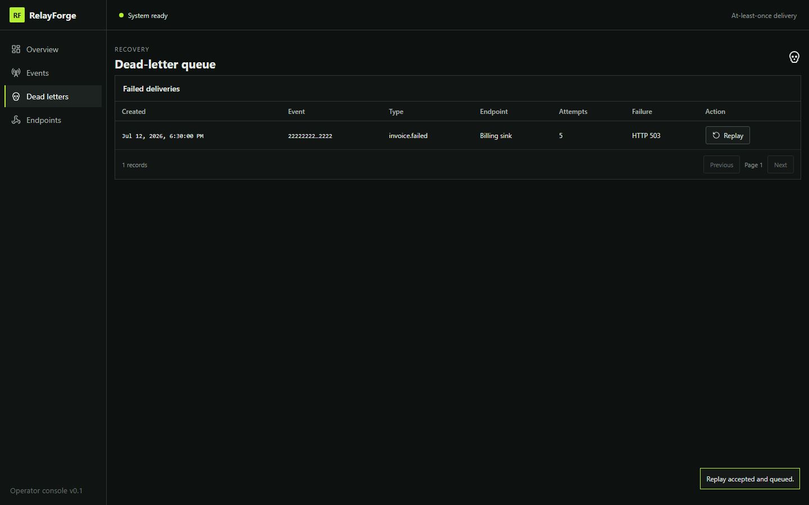
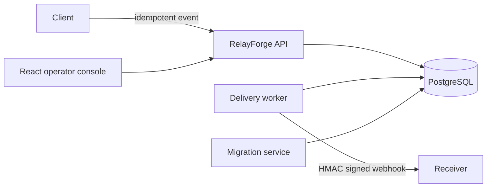

# RelayForge

[](https://github.com/Lob0Garou/relayforge/actions/workflows/ci.yml)
[](LICENSE)

RelayForge is a self-hosted webhook delivery control plane built with .NET 8, PostgreSQL, and React. It accepts idempotent events, signs outbound requests, retries transient failures, exposes a dead-letter/replay workflow, and gives operators a compact delivery dashboard.



## Run the local demo

Requirements: Docker Desktop with Compose v2. The stack uses host ports `5173`, `5000`, and `5433` by default.

```powershell
docker compose up --build -d --wait
```

Open <http://localhost:5173>, then run the deterministic API demo:

```powershell
./scripts/demo.ps1
```

Stop only this project and delete its demo volumes:

```powershell
docker compose down -v
```

The Compose defaults are synthetic and intended only for an isolated development machine. Copy `.env.example` to `.env` to change ports or demo credentials. Never expose this v0.1 stack to an untrusted network: its operator APIs and the receiver's Development-only secret rotation control intentionally have no authentication.

## Architecture



PostgreSQL is the source of truth. Event acceptance and delivery creation share a transaction; workers claim durable leases and persist every attempt. See [architecture](docs/architecture.md) and [guarantees](docs/guarantees.md).

## What v0.1.0 provides

- endpoint registration with one-time generated signing secrets;
- global idempotency keys with canonical JSON fingerprints;
- durable, at-least-once delivery with bounded concurrency;
- HMAC-SHA256 signatures over timestamp, delivery ID, and exact body bytes;
- capped exponential retry with jitter, dead letters, and manual replay;
- SSRF controls: one DNS resolution per connection, public-address validation, no redirects or proxy use;
- sanitized delivery diagnostics, health endpoints, and OpenTelemetry instruments;
- a responsive operations dashboard and an intentionally unstable demo receiver.

RelayForge does not promise exactly-once delivery, receiver-side deduplication, ordered delivery, or zero-loss operation after an acknowledged receiver response is lost. Read the precise contract in [guarantees](docs/guarantees.md).

## Development and quality gates

The repo pins SDK `10.0.301` to read the `.slnx`, while all projects target `net8.0`.

```powershell
dotnet tool restore
dotnet slopwatch --no-baseline --fail-on warning
dotnet restore RelayForge.slnx --locked-mode
dotnet build RelayForge.slnx -c Release --no-restore
dotnet test RelayForge.slnx -c Release --no-build

Set-Location src/RelayForge.Web
npm.cmd ci
npm.cmd audit --audit-level=high
npm.cmd run lint
npm.cmd run typecheck
npm.cmd test
npm.cmd run build
npx.cmd playwright install chromium
npm.cmd run test:e2e
```

Integration tests and CI use disposable PostgreSQL Testcontainers. See the [demo guide](docs/demo.md) for a guided failure/replay walkthrough.

## Security model

Endpoint secrets are generated once and stored through ASP.NET Core Data Protection. The demo persists its keyring in a named Docker volume. Non-development deployments must provide persistent keys protected by an X509 certificate and must add authentication, authorization, TLS termination, network isolation, secret management, backups, and production observability before exposure.

Outbound private-host allowlisting is accepted only in `Development`; Compose allows exactly `unstable-receiver`. Wildcards and IP literals are rejected.

## Roadmap

- authenticated multi-tenant operator access;
- secret rotation and receiver verification tooling;
- delivery ordering controls and rate limiting;
- production deployment manifests and backup/restore guidance;
- richer alerting and trace correlation.

See [release notes](RELEASE_NOTES.md). Licensed under [MIT](LICENSE).
